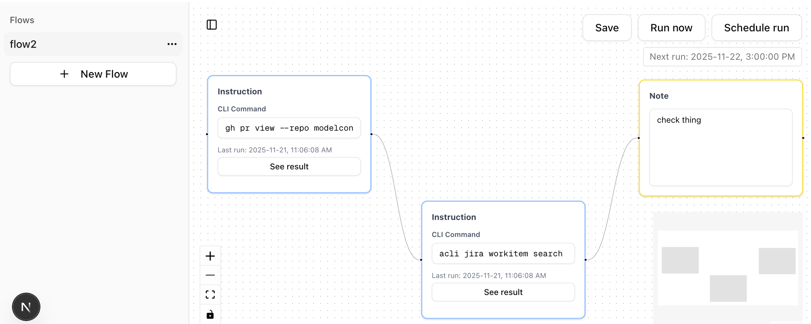

# emflow

A lightweight visual flow-based task automation tool designed for engineering managers to document recurring worflows and automate tasks that use command-line tools.



## Overview

emflow enables you to:
- **Visualize workflows** as node-based flows with dependencies
- **Document processes** with instruction and note nodes
- **Automate CLI tasks** by executing commands in dependency order
- **Schedule execution** of entire flows at specific times
- **Track results** with JSON output visualization

## Getting Started

### Installation

```bash
npm install
```

### Development

```bash
npm run dev
```

Open [http://localhost:3000](http://localhost:3000) in your browser.

### Configuration

By default, flows are saved to a `flows/` directory in your project. To use a custom directory, specify the `SAVED_FLOWS_DIR` env var:

```bash
SAVED_FLOWS_DIR=/path/to/your/flows
```

## License

MIT
